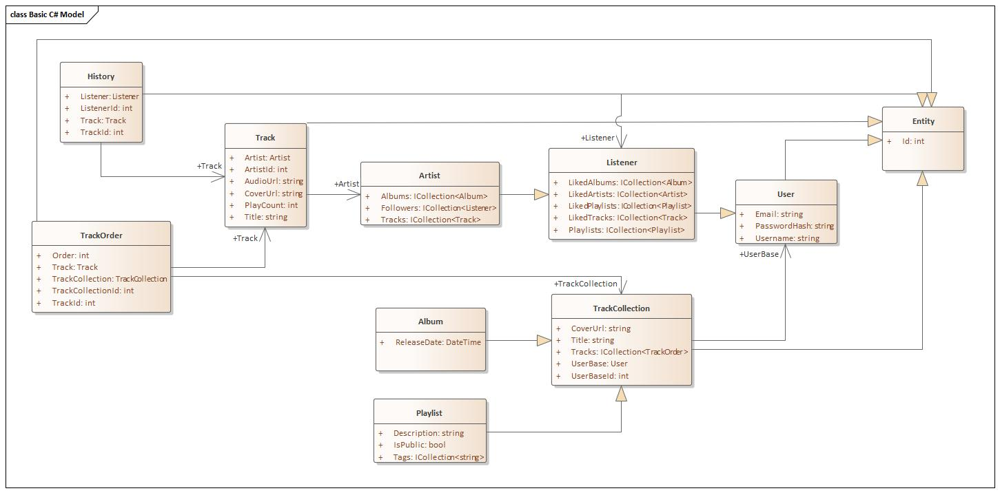

## Project Description

**Project Name:** Harmony

**Developer:** Forinov Egor

**Group Number:** 253505

Harmony is a dynamic music application designed to cater to both music enthusiasts (Listeners) and aspiring artists. The application provides a seamless and enjoyable music experience with a range of features tailored for both user types.

## Class Diagram



## List Of Functions

1. **Music Playback**

   - _Description:_ Allows users to listen to their favorite tracks and albums.

2. **Favorites Management**

   - _Description:_ Enables users to add or remove tracks to/from their favorites for quick access.

3. **Playlist Management**

   - _Description:_ Provides functionality for creating, editing, and deleting playlists.

4. **Track Manipulation in Playlists**

   - _Description:_ Allows users to add or remove tracks from playlists, providing a personalized listening experience.

5. **Favorite Artists/Albums/Playlists**

   - _Description:_ Allows users to mark their preferred artists, albums, and playlists as favorites for easy access.

6. **Music Upload for Artists**

   - _Description:_ Enables artists to upload their own tracks and albums to share with the community.

7. **Listening Statistics for Artists**
   - _Description:_ Provides artists with statistics on the listening frequency of their tracks, aiding in assessing popularity.

## Data Models Description

### Entity

```csharp
public class Entity
{
    public int Id { get; set; }
}
```

### User

```csharp
public class User : Entity
{
    public string Username { get; set; } = string.Empty;
    public string Email { get; set; } = string.Empty;
    public string PasswordHash { get; set; } = string.Empty;
}
```

### Listener

```csharp
public class Listener : User
{
    public ICollection<Playlist> Playlists { get; set; } = [];
    public ICollection<Artist> LikedArtists { get; set; } = [];
    public ICollection<Track> LikedTracks { get; set; } = [];
    public ICollection<Album> LikedAlbums { get; set; } = [];
    public ICollection<Playlist> LikedPlaylists { get; set; } = [];
}
```

### Artist

```csharp
public class Artist : Listener
{
    public ICollection<Track> Tracks { get; set; } = [];
    public ICollection<Album> Albums { get; set; } = [];
    public ICollection<Listener> Followers { get; set; } = [];
}
```

### Track

```csharp
public class Track : Entity
{
    public string Title { get; set; } = string.Empty;
    public string AudioUrl { get; set; } = string.Empty;
    public string CoverUrl { get; set; } = string.Empty;
    public int PlayCount { get; set; }

    public int ArtistId { get; set; }
    public Artist? Artist { get; set; }
}
```

### TrackCollection

```csharp
public class TrackCollection : Entity
{
    public string Title { get; set; } = string.Empty;
    public string CoverUrl { get; set; } = string.Empty;

    public ICollection<TrackOrder> Tracks { get; set; } = [];
    public int UserId { get; set; }
    public User? User { get; set; }
}
```

### Album

```csharp
public class Album : TrackCollection
{
    public DateTime ReleaseDate { get; set; }
}
```

### Playlist

```csharp
public class Playlist : TrackCollection
{
    public string Description { get; set; } = string.Empty;
    public bool IsPublic { get; set; }
    public ICollection<string> Tags { get; set; } = [];
}
```
